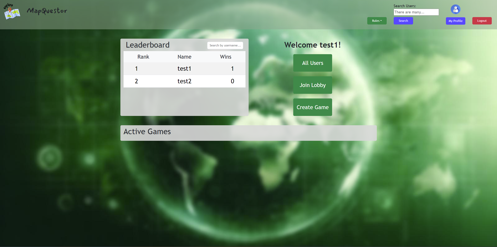
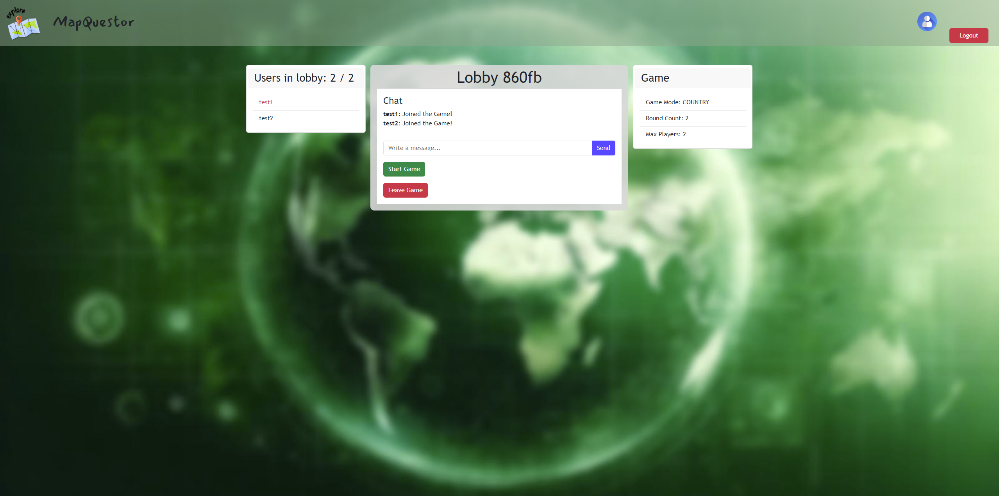
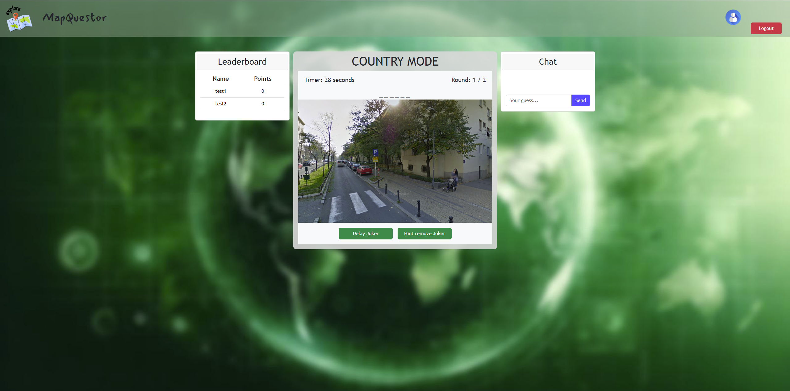
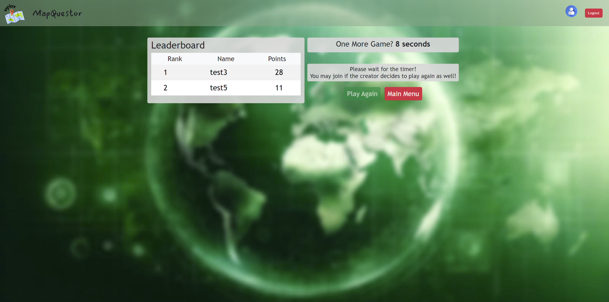

# MapQuestor
<div style="text-align: justify">


Have you ever wanted to travel the world, but lack the money and time? That's where MapQuestor comes in mind... What are you waiting for? Become a MapQuestor!
P.S. go check out our back-end implementation [here](https://github.com/sopra-fs24-group-40/mapquestor-server).

## 📜 Table of Contents

1. [👋 Introduction](#introduction)
2. [🛠️ Technologies](#technologies)
3. [🧭 High-level components](#highlevelcomponents)
4. [🏎️ Launch & Deployment](#launchanddeployment)
5. [🩻 Illustrations](#illustrations)
6. [🛣️ Roadmap](#roadmap)
7. [👔 Authors and acknowledgment](#authorsandacknowledgment)
8. [📝 License](#license)

<a id="introduction"></a>
## 👋 Introduction

To give people a fun way of learning about potential sightseeing destinations, we introduce a game called MapQuestor. It is playable by multiple users at once, this will increase engagement and raise a competitive spirit. A picture of a place of interest will be shown to the players and they must guess which city or country it is from. 

<a id="technologies"></a>
## 🛠️ Technologies

For the devolopment of the client, we relied on the following technologies:

* [JavaScript](https://devdocs.io/javascript/) - Programming language
* [TypeScript](https://www.typescriptlang.org/docs/) - Programming language
* [REACT](https://reactjs.org/) - Front-end TypeScript library
* [Bootstrap](https://getbootstrap.com/) - Front-end library
* [Axios API](https://axios-http.com/docs/api_intro) - Used for REST-based communication with the server
* [Stomp](https://stomp-js.github.io/stomp-websocket/) - Used for websocket communication with the server
* [Google Maps Streetview API](https://developers.google.com/maps/documentation/javascript/streetview?hl=de) - Used to embed streetview into the game

<a id="highlevelcomponents"></a>
## 🧭 High-level components

Below you can see our main components.

### 🎮 Game

[Game](https://github.com/sopra-fs24-group-40/mapquestor-client/blob/main/src/components/views/game/Game.tsx) is the first view after logging in or registering. Users can view the leaderboard on the left hand side and below the leaderboard they can see what games are active, if there are any. If a lobby is not full yet, they will have the opportunity to join. On the right hand side, users can navigate through different pages, e.g. if they want to view all registered users, join a lobby via game code or create a game. On top they can search for a user, go direct to their profile page, or log out.

### 🛋️ Create Game

A user can create a Lobby via [Create Game](https://github.com/sopra-fs24-group-40/mapquestor-client/blob/main/src/components/views/game/CreateGame.jsx) and become the creator of the game. The user can make a game for 2 to 5 people, assign the round cound from 2 to 10, and choose round length between 30s, 60s, or 90s. In the end, the creator will have the opportunity to choose the mode, whether they want to guess the country or city name. After creating, user will be directed to the corresponding lobby, where other users can join and chat with eachother.

### 🕹️ Main Game

[Main Game](https://github.com/sopra-fs24-group-40/mapquestor-client/blob/main/src/components/views/game/gameparts/MainGame.jsx) is used as a communicator between client and server. Lobby, Ingame, and Endgame all communicate via the Main Game. All websocket requests are handled inside this file as well as responses from the server. It handles joining a game in lobby, updating points after a round, concluding a game after finishing it, leaving a game, whether it is a user or creator, and many more. Some of these functionalities are passed in either Lobby, Ingame, or Endgame.

<a id="launchanddeployment"></a>
## 🏎️ Launch & Deployment

The following steps are needed for a new developer joining our team.

### 🗺️ Prerequisites and Installation

- For the development environment, Node.js is needed. We worked with the exact version [**v20.11.0**](https://nodejs.org/download/release/v20.11.0/) which comes with the npm package manager.
- Update the npm package manager to **10.4.0** by running ```npm install -g npm@10.4.0```. Check the correct version by running ```node -v``` and ```npm --version```, which should give you **v20.11.0** and **10.4.0** respectively.
- Run this command to install all other dependencies, including React by running ```npm install```
- Furthermore, you need to install Google Maps by running ```npm install @googlemaps/js-api-loader```

### 🔨 Build and Run

- Build the app by running ```npm run build```
- Start the app by running ```npm run dev```
- Open [localhost](http://localhost:3000) to view it in browser. _We recommend you to use Google Chrome._

### 📈 Testing

- Run tests by running ```npm run test```
    - _For macOS user with a 'fsevents' error --> https://github.com/jest-community/vscode-jest/issues/423_

### 💡 External dependencies

Both client and server have to be running for the application to behave as expected.

### ✉️ Releases

We stronlgy recommend to follow this [tutorial](https://docs.github.com/en/repositories/releasing-projects-on-github/managing-releases-in-a-repository) and to properly document and comment your release.

<a id="illustrations"></a>
## 🩻 Illustrations

The first screen after login is the Game screen.



After creating a game in Create Game user will be forwarded to the Lobby, in here the game can be started or users can just chat.



After starting a game, all users in the Lobby are now seeing the Ingame screen. In the center is the Street View, on the lefthand side is the leaderboard, and on the righthand side is the chat where users can type in their guesses.



After finishing a game users will see the Endgame view. The Final leaderboard of this game can be viewed and users can decide if they want to play again or go back to the Game screen (Main Menu button).




<a id="roadmap"></a>
## 🛣️ Roadmap

- _Global leaderboard_ --> Leaderboard could be filterable by metrics (e.g. time or mode).
- _Joker assignment_ --> Assign jokers depending on points after each round (e.g. player with least points gets a joker).
- _Worldwide_ --> Include more cities and countries from other continents and game modes (e.g. City-Europe, Country-South-America, etc.).

<a id="authorsandacknowledgment"></a>
## 👔 Authors and acknowledgment

Authors of MapQuestor:

- [Branislav Milutinović](https://github.com/B-M)
- [Shanthos Magendran](https://github.com/LaughingF0x)
- [Benjamin Halfar](https://github.com/bhalf)
- [Nikola Stevanović](https://github.com/nik-stev)
- [Arbër Markaj](https://github.com/domeniku7)

We want to use this opportunity to thank our teaching assistant [Louis Caerts](https://github.com/LouisCaerts). His guidance and assistance during our journey were helpful and we really appreciated it.

<a id="license"></a>
## 📝 License

This project is licensed under the Apache License Version 2.0.

</div>
